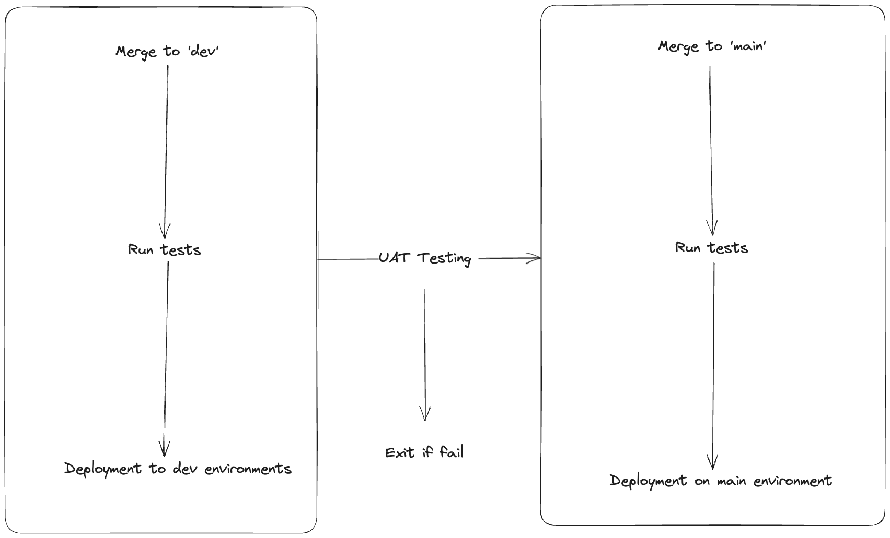
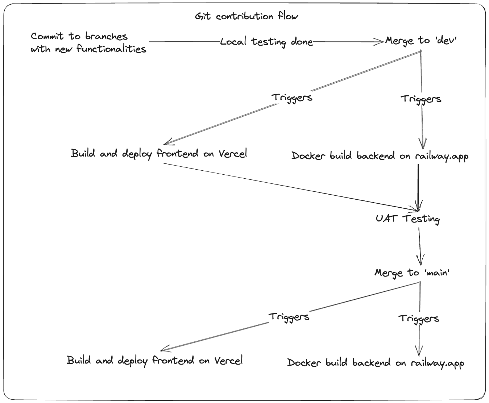

# StockChecker - 101343

# Table of content

- [Preface](#preface)
  - [User stories](#user-stories)
  - [Asumptions](#asumptions)
- [Implementation](#implementation)
  - [Frontend](#frontend)
  - [Backend](#backend)
    - [GET All](#get-all)
    - [GET One](#get-one)
    - [POST](#post)
    - [PUT](#put)
    - [DELETE](#delete)
- [Testing](#testing)
  - [Backend](#backend-1)
  - [Frontend](#frontend-1)
    - [User Story 1 - John](#user-story-1---john)
    - [User Story 2 - Jane](#user-story-2---jane)
    - [User Story 3 - Painter](#user-story-3---painter)
- [CI/CD](#ci-cd)
  - [Pipeline](#pipeline)
  - [Git contribution flow](#git-contribution-flow)
  - [Database](#database)
- [Running locally](#running-locally)

# Preface

Kanban style stock management website allowing users to drag and drop cards representing products between Out of Stock, Running Low and Available swim lanes.

## User stories

- As John I want to be able to view a list of paint availability.
- As Jane I want to view the paint availability and update inventory whenever orders come in.
- As a painter, I want to be able to view paints stock and update inventory quickly.

## Asumptions

Based the above stories I assumed the following in implementation:

- Running Low status applies to items with 5 or lower in stock, Out of Stock applies to items with 0 in stock.
- The application must be usable on phones and computers.
- The amount of paint items are fixed to 5 colors: blue, grey, black, white, and purple.
- The paint items exist as cards on a Kanban board.
- There are 3 lanes representing 3 different statuses: Available, Running Low, and Out of Stock.
- Paint cards can be drag-and-drop, updating inventory quickly.
- Paint cards also contain an edit button for changing specific details.
- User's role is devided into read-only or edit.

# Implementation

The application is implemented as a full-stack application using the following technologies:

## Frontend

The frontend is built using NextJS. It is a React-based framework allowing for fast access with minimal JavaScript bundle size.NextJS serves HTML bundles to the user depending on the routes being accessed.

Frontend has the following 2 routes:

- `/`: main index route with a landing page with information on the website.
- `/board`: Contain the main stock management Kanban board.

## Backend

Backend is built using ExpressJS with NodeJS + Prisma using TypeScript and follows a RESTful approach to API design.

Backend uses Prisma to connect and conduct CRUD operations on a database for data persistance.

Backend contains the following routes:

### GET All

| Property              | Description                                                                                                                   |
| --------------------- | ----------------------------------------------------------------------------------------------------------------------------- |
| Endpoint              | GET `/paint`                                                                                                                  |
| Purpose               | Retrieve all paints stored in the database                                                                                    |
| Request Authorization | Bearer token is required on the request                                                                                       |
| Request parameters    | None                                                                                                                          |
| Response              | A list of all paints stored in the database                                                                                   |
| Error handling        | 401 "Token Invalid" or "Not Authorized" if user does not have any roles or not logged in, or any issues with the bearer token |
|                       | 500 "Internal Server Error" if there's an error during operations                                                             |

### GET One

| Property              | Description                                                                                                                   |
| --------------------- | ----------------------------------------------------------------------------------------------------------------------------- |
| Endpoint              | GET `/paint/:id`                                                                                                              |
| Purpose               | Retrieve a paint with the id in params                                                                                        |
| Request Authorization | Bearer token is required on the request                                                                                       |
| Request parameters    | id - paint id                                                                                                                 |
| Response              | The paint item with the id from params                                                                                        |
| Error handling        | 401 "Token Invalid" or "Not Authorized" if user does not have any roles or not logged in, or any issues with the bearer token |
|                       | 500 "Internal Server Error" if there's an error during operations                                                             |

### POST

| Property              | Description                                                                                                                   |
| --------------------- | ----------------------------------------------------------------------------------------------------------------------------- |
| Endpoint              | POST `/paint`                                                                                                                 |
| Purpose               | Create a new paint item                                                                                                       |
| Request Authorization | Bearer token is required on the request                                                                                       |
| Request parameters    | None                                                                                                                          |
| Request body          | `name` - name of the paint, `stock` - current inventory of the paint, `status` - current stock status of the paint            |
| Response              | The paint created                                                                                                             |
| Error handling        | 401 "Token Invalid" or "Not Authorized" if user does not have edit role or not logged in, or any issues with the bearer token |
|                       | 500 "Internal Server Error" if there's an error during operations                                                             |

### PUT

| Property              | Description                                                                                                                                          |
| --------------------- | ---------------------------------------------------------------------------------------------------------------------------------------------------- |
| Endpoint              | PUT `/paint/:id`                                                                                                                                     |
| Purpose               | Update a paint item                                                                                                                                  |
| Request Authorization | Bearer token is required on the request                                                                                                              |
| Request parameters    | `id` - id of the paint to be updated                                                                                                                 |
| Request body          | `name` - name of the paint, `stock` - current inventory of the paint, `status` - current stock status of the paint, `updatedAt` - date of the update |
| Response              | The paint updated                                                                                                                                    |
| Error handling        | 401 "Token Invalid" or "Not Authorized" if user does not have edit role or not logged in, or any issues with the bearer token                        |
|                       | 500 "Internal Server Error" if there's an error during operations                                                                                    |

### DELETE

| Property              | Description                                                                                                                   |
| --------------------- | ----------------------------------------------------------------------------------------------------------------------------- |
| Endpoint              | DELETE `/paint/:id`                                                                                                           |
| Purpose               | Delete a paint item                                                                                                           |
| Request Authorization | Bearer token is required on the request                                                                                       |
| Request parameters    | `id` - id of the paint to be deleted                                                                                          |
| Response              | The paint deleted                                                                                                             |
| Error handling        | 401 "Token Invalid" or "Not Authorized" if user does not have edit role or not logged in, or any issues with the bearer token |
|                       | 500 "Internal Server Error" if there's an error during operations                                                             |

# Testing

## Backend

Backend testing is handled with jest, please refer to the code generated below for coverage:

| File        | % Stmts | % Branch | % Funcs | % Lines | Uncovered Line #s |
| ----------- | ------- | -------- | ------- | ------- | ----------------- |
| All files   | 78.64   | 19.23    | 63.63   | 79.06   |
| auth        | 23.07   | 0        | 0       | 25      |
| auth.ts     | 23.07   | 0        | 0       | 25      | 11-28             |
| controllers | 91.3    | 45.45    | 100     | 90      |
| ...ller.ts  | 91.3    | 45.45    | 100     | 90      | ...,65,95,126,138 |
| services    | 71.42   | 100      | 40      | 78.57   |
| ...vice.ts  | 71.42   | 100      | 40      | 78.57   | 7,17,83           |

## Frontend

Frontend does not have any automated testing, but we can test the front end using the following UAT scripts:

### User Story 1 - John

Requirements: Logins for John.

Acceptance Criterias: John can view which paint is available.

1. Open the site on an Android or iOS device, log in with John's credentials.
2. Access board page
3. There are 3 lanes with: Available, Running Low and Out of Stock.
4. Paint items are in the appropriate swim lane.

### User Story 2 - Jane

Requirements: Logins for Jane.

Acceptance Criterias: Jane can view and update each paint's inventory and status.

1. Open the site on a laptop or computer.
2. Access board page
3. There are 3 lanes with: Available, Running Low and Out of Stock.
4. Paint items are in the appropriate swim lane.
5. Press edit button, fill out new inventory, save after finished.
6. Check if item is updated to the appropriate swim lane (>5 for Available, between 5 and 0 for Running Low, 0 for Out of Stock).
7. Refresh page and ensure all items are still in the right lane.

### User Story 3 - Painter

Requirements: Logins for a painter

Acceptance Criterias: Painter can view and update stock quickly.

1. Open the site on a laptop or computer.
2. Access board page
3. There are 3 lanes with: Available, Running Low and Out of Stock.
4. Paint items are in the appropriate swim lane.
5. Drag an item to Out of Stock, the item will be updated to Out of Stock, stock automatically set to 0.
6. Drag an item to Running Low or Available, a popup will appear prompting user to enter new stock amount.
7. Check if item is updated to the appropriate swim lane (>5 for Available, between 5 and 0 for Running Low, 0 for Out of Stock).
8. Refresh page and ensure all items are still in the right lane.

# CI/CD

CD is handled by Vercel and Railway, which is the 2 deployment platforms. Both platforms detect pushes to dev and main branches, builds, configures and triggers a deployment on the respective environment.

CI is handled by github actions.
Pipiline tests, builds and deploy each PR for testing.

## Pipeline

## Git contribution flow

'main' branch contains prod code and is protected. any changes has to be made in its own branch or in 'dev' and merged with a PR.

## Database

This deployment is under the assumption that a database has been created and ready for connection.

# Running locally

Prerequisite:

- https://nodejs.org/en

Open this repo and execute the following command:
`npm install`

Respective instructions to set up Frontend and Backend is available on the following:

- [Backend](./packages/backend/README.md)
- [Frontend](./packages/frontend/README.md)
